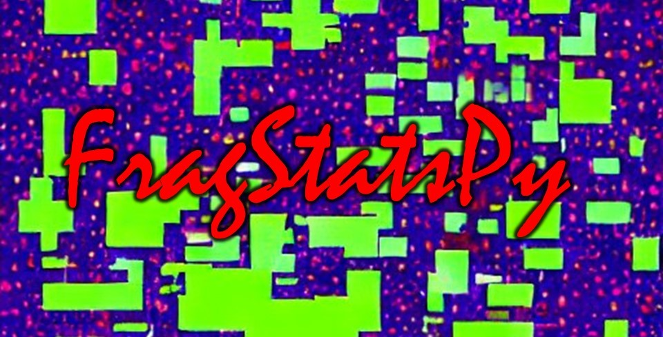

## Python Wrapper for Fragstats

FragStatsPy a wrapper to [Fragstats](https://fragstats.org/) that allows for automated model setup and execution.  While Fragstats currently provides a command-line tool for model execution, it does not provide command-line tools for model setup.  FragStatsPy begins to fill that gap by providing functions to generate and manipulate Fragstats models from within Python.

Current functionality includes
* Model database generation
* Loading landscape layers
* Setting the output base path
* Defining a sampling strategy
* Linking user-defined tiles
* A general purpose SQL editor to allow for complete model manipulation (for savvy users)
* Access to the Fragstats native run commands (command-line)

## Example Code

The code below will setup and run a Fragstats model to calculate the mean and standard deviation of patch sizes per user-defined region.
```python
import src.frag_model as fspy

model = fspy.FragModel('model_py.fca')
model.set_output_base_path('model_outputs')
model.load_landscape_layer("geomorphic_patches.tif")
model.set_user_provided_tiles("regions.tif")
model.set_sampling_strategy(strategy='user_tiles', landscape=True)
model.toggle_metric(level='l', metric='AREA', stat='MN', on=True)
model.toggle_metric(level='l', metric='AREA', stat='SD', on=True)
model.run_model()
results = model.get_results()
```

## Installation

`FragStatsPy` can be installed using pip:
	
    $ python3 -m pip install FragStatsPy

Conda may come soon, if there's interest.

## Funding

Funding for this project was provided by the National Oceanic & Atmospheric
Administration (NOAA), awarded to the Cooperative Institute for Research to
Operations in Hydrology (CIROH) through the NOAA Cooperative Agreement
with the University of Alabama (NA22NWS4320003).