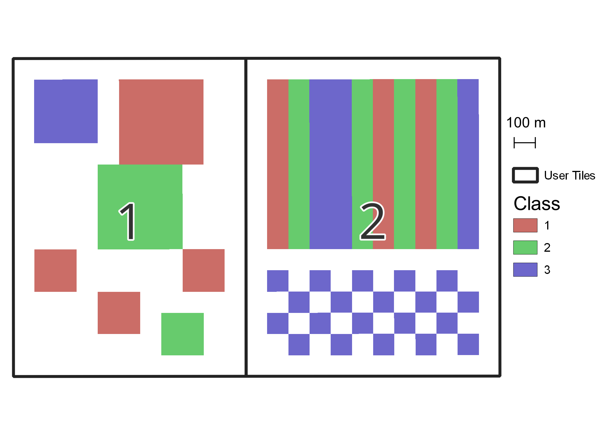
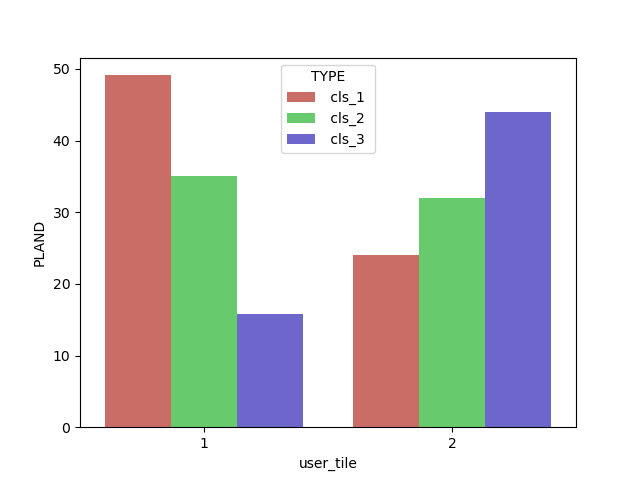
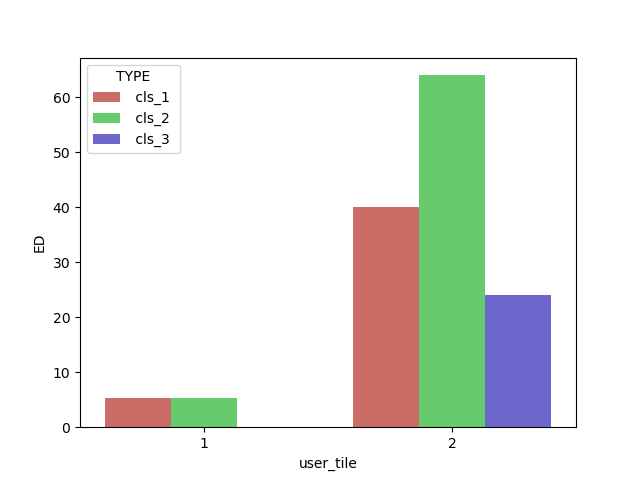
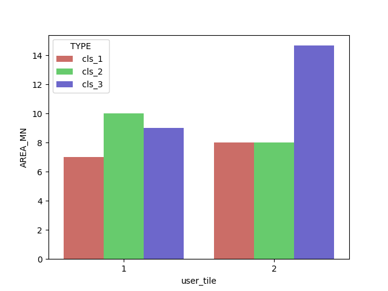
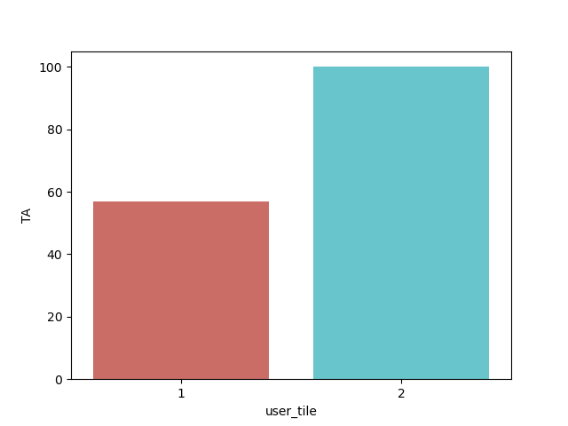

## Simple Example With Synthetic Geometry

In this example we will validate fragstats metric accuracy with some simple synthetic geometry.  We've developed a three-class raster with some rectangles in it as well as two user-defined tiles (1 and 2) to subset our analysis.  



We'll start by creating a new Fragstats model and setting up the inputs and outputs.

```python
import matplotlib.pyplot as plt
import seaborn as sns
import FragStatsPy.frag_model as fspy

model = fspy.FragModel(r'samples\simple_example\simple_model.fca')

model.load_landscape_layer(r"samples\simple_example\classes.tif")

model.set_output_base_path(r'samples\simple_example\model_outputs')

model.set_user_provided_tiles(r"samples\simple_example\user_tiles.tif")
model.set_sampling_strategy(strategy='user_tiles', landscape=True, class_=True)
```

Now, lets select the metrics to calculate.  Today we'll be calculating
* Class Metrics
  * Percentage of Landscape (PLAND)
  * Edge Density (ED)
  * Patch Area Mean (AREA_MN) 
* Landscape Metrics
  * Total Area (TA)

Which get coded as
```python
model.toggle_metric(level='c', metric='PLAND')
model.toggle_metric(level='c', metric='ED')
model.toggle_metric(level='c', metric='AREA_MN')

model.toggle_metric(level='l', metric='TA')
```

Now we hit run and view the results.

```python
model.run_model()
results = model.get_results()

# parse some results and prepare for plotting
results['class']['user_tile'] = results['class']['LID'].apply(lambda s: int(s.split('\\')[-1]))
results['land']['user_tile'] = results['land']['LID'].apply(lambda s: int(s.split('\\')[-1]))
results['class'] = results['class'].sort_values('TYPE')

# Plot
sns.barplot(x='user_tile', hue='TYPE', y='PLAND', data=results['class'], palette = 'hls')
plt.show()

sns.barplot(x='user_tile', hue='TYPE', y='ED', data=results['class'], palette = 'hls')
plt.show()

sns.barplot(x='user_tile', hue='TYPE', y='AREA_MN', data=results['class'], palette = 'hls')
plt.show()

sns.barplot(x='user_tile', y='TA', data=results['land'], palette = 'hls')
plt.show()
```


Here we see that the percentage of each tile occupied by each class matches what our eye can pick out on the source image.


Since the patches in user tile 2 are much longer than the squares in tile 1, their edge densities are greater.  The small squares on the bottom right draw down the average for class 3 in tile 2.


Since our model uses the 8 cell neighborhood rule by default, the checkerboard of class 3 in tile 2 is all counted as one patch with a relatively large area.


No surprises here, tile 2 has more patch area than tile 1.